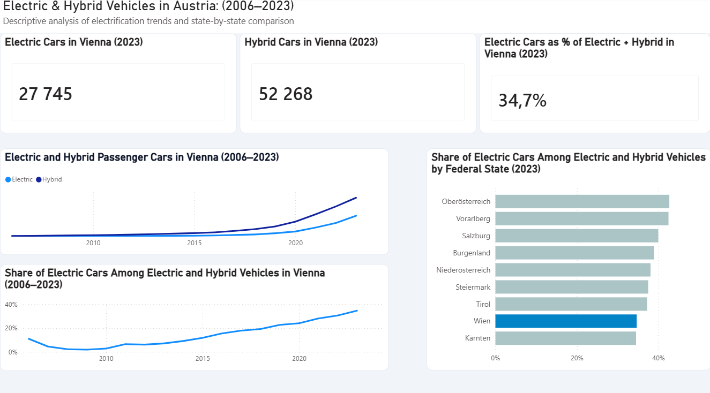

# Electrification of Passenger Cars in Austria

### Vienna vs. Federal States, 2004–2023

## Project Overview

This project analyzes the development of electric and hybrid passenger cars in Austria, with a particular focus on Vienna.

The goal was to understand how the number and composition of electric and hybrid vehicles changed over time and how Vienna compares with other Austrian federal states.

## Research Questions

1. How did the number of electric and hybrid passenger cars change over time?
2. Which type of vehicle grew faster – electric or hybrid?
3. How did the composition of electric and hybrid vehicles change over time?
4. How does Vienna compare with the other Austrian federal states?

## Key Findings

- The number of electric and hybrid vehicles increased substantially over the observed period.
- Electric vehicles experienced particularly strong growth in the later years.
- In Vienna, the share of electric vehicles among electric and hybrid vehicles increased from around 2–11% in the early years to approximately 35% in 2023.
- Vienna had the third-highest absolute number of electric vehicles in 2023, but its electric share was among the lowest compared with other Austrian federal states.

## Tools

- Microsoft Excel
- Power Query
- Power BI
- DAX

## Data

The project uses publicly available data from Statistik Austria covering Austrian federal states from 2004 to 2023.

## Dashboard

The interactive Power BI dashboard presents:

- the development of electric and hybrid vehicles in Vienna;
- the changing share of electric vehicles;
- a comparison of Austrian federal states in 2023.

## Limitations

The EV share used in this project represents the share of electric vehicles among electric and hybrid vehicles. It does not represent the share of electric vehicles among all passenger cars.

Hybrid data are unavailable for 2004 and 2005, so direct comparisons between electric and hybrid vehicles begin in 2006.

## Detailed Report

For the full methodology, analysis, visualizations and recommendations, see the project report.

## Author

Bohdan Tavolzhanskyi
